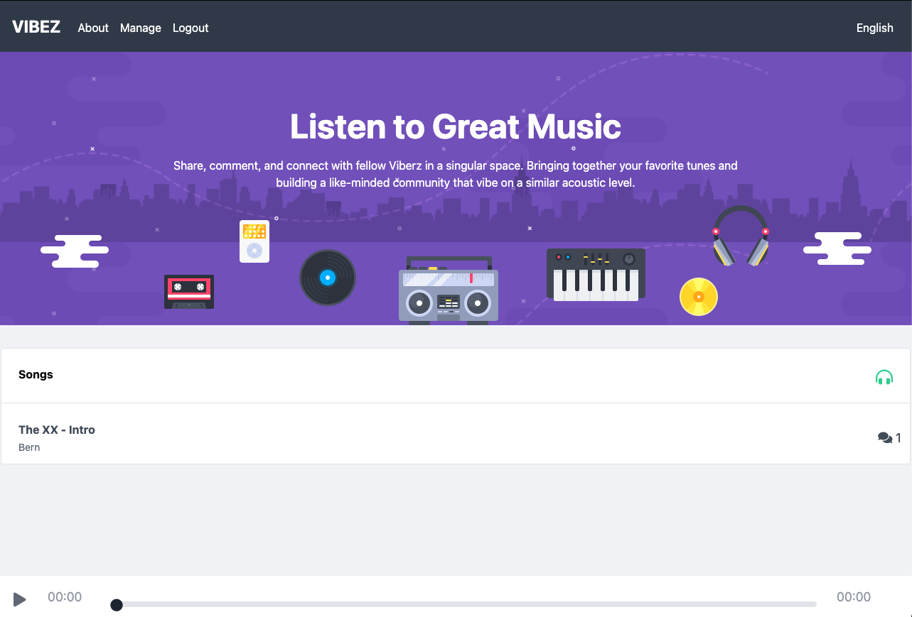

  <a href="#wave-intros">Intros</a>&nbsp;&nbsp;&nbsp;|&nbsp;&nbsp;&nbsp;
  <a href="#muscle-motivation">Motivation</a>&nbsp;&nbsp;&nbsp;|&nbsp;&nbsp;&nbsp;
  <a href="#gear-core-tech-stack">Tech Stack</a>&nbsp;&nbsp;&nbsp;|&nbsp;&nbsp;&nbsp;
  <a href="#calling-main-features">Features</a>&nbsp;&nbsp;&nbsp;|&nbsp;&nbsp;&nbsp;
  <a href="#memo-license-">License</a>&nbsp;&nbsp;&nbsp;|&nbsp;&nbsp;&nbsp;
  <a href="#warning-disclaimer">Disclaimer</a>

# **🎧 VIBEZ**

## :wave: Intros!

👉&nbsp; **[Live Preview](https://vibez-six.vercel.app/ 'VIBEZ')**

Vibez is an music platform website with base features that are commonly seen in modern-day sharing platforms, such as users are able to either register for a new account or login to an existing one with uploading music files and comment features made available to only successfully-authenticated registered users.

FYI: _**If you would like to try out the application but do not wish to manually sign up for an account, you can use the provided test account below.**_

- Email: **vibez_user@gmail.com** &nbsp;:e-mail:
- Password: **vpM6A&HlZmRh** &nbsp;:closed_lock_with_key:

## :muscle: Motivation

With experience mainly working with the React library, I was curious about how the other JavaScript frameworks work in comparison to React. With the increasingly number of vouches from developers and a rapidly-rising direct contender to React and Angular, these ultimately lead me to the decision of trying out the Vue framework.

With the core motivation of simply experimenting and getting an overall familiarity with the framework, I decided to settled for a more simplistic design and focus on more the inner workings of the framework. With that, the focus was shifted towards working on the functionality of a number of features in an application with common use-case found in real-life applications like login forms, page routing, file-uploading, and more.

## :gear: Core Tech Stack

- :basecamp:&nbsp; Vue
- :vs:&nbsp; Vuex
- :link:&nbsp; Vue Router
- :key:&nbsp; Vee-Validate
- :wind_face:&nbsp; Tailwind CSS
- :fire:&nbsp; Firebase Cloud Firestore & Storage
- :black_joker:&nbsp; Jest

## :calling: Main Features

- Music player to play any uploaded music with timestamp selection, available to both guest and registered users.
- Login & Register authentication through email & password with form field validation.
- File uploading and editing through a 'Manage' section made available to verified logged-in users.
- Commenting on any user uploaded music, made available to only verified logged-in users.
- Built as a Progressive Web Application **(PWA)** that enhances overall user experience on both desktop and mobile devices.

## :memo: License 

This project is licensed under the terms of the MIT license. For more information, please refer to the license [documentation](LICENSE.md).

## :warning: Disclaimer

As Vibez is not an actual music platform meant to be used commercially, this is not a full-fledged application and some other common features, such as user profile details editing are not available. This is intentional by design, as this project was built to gain a better understanding and overall familiarity with the Vue framework and its comparison to the React framework.

The contents of these pages are provided as an information guide only. While every effort is made in preparing the material for publication, no responsibility is accepted by or on behalf of the owner(s) for any errors, omissions or misleading statements on these pages or any site to which these pages connect. Although every effort is made to ensure the reliability of listed sites this cannot be taken as an endorsement of these sites.
